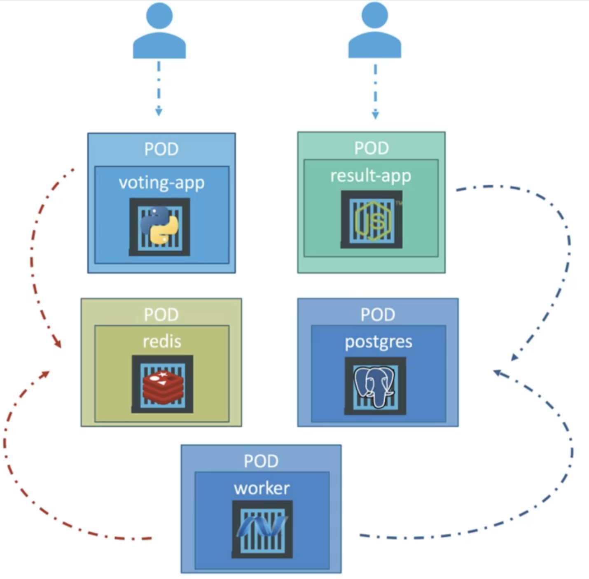

<div align="center" id="top"> 
  

&#xa0;

</div>
<h1 align="center">Kubernetes Workshop</h1>

## 🎯 Introducción

El objetivo de este workshop es desplegar localmente un sistema de votación utilizando las diferentes herramientas que ofrece Kubernetes.

## ✅ Requerimientos

Para el desarrollo del workshop deberá tener instalado en su computadora Docker Desktop y haber habilitado Kubernetes. Se recomienda además tener un editor de texto como Visual Studio Code para los archivos YAML.

- [Instalación de Docker Desktop](https://www.docker.com/products/docker-desktop/)
- [Guía de activación de Kubernetes](https://docs.docker.com/desktop/kubernetes/)
- [Instalación de Visual Studio Code](https://code.visualstudio.com/download)

## 🏗️ Estructura del proyecto

La plataforma está conformada por las siguientes partes:

- **App de votación**: app de Flask desde la cual los usuarios podrán registrar su voto en la encuesta.
- **Panel de resultados**: app de NodeJS desde la cual se podrán observar los votos registrados en cada categoría.
- **Sistema de cache**: utilizando Redis se almacena de forma temporal los votos registrados por los usuarios.
- **Worker**: app de .NET Core encargada de trasladar los resultados almacenados en Redis hacia la base de datos.
- **Base de datos**: se utiliza Postgres como base de datos para almacenar los votos de los usuarios.

Cada uno de los elementos de la plataforma será administrada en contenedores por separado de Docker, de la siguiente manera:
<br/>

<div align="center" id="architecture">

  
</div>

## 🗳️ Pods

Cada Pod dentro de la arquitectura tendrá únicamente un contenedor. La imagen para cada uno de los contenedores se definirá en los archivos YAML. Las imágenes ya se encuentran almacenadas en [Docker Hub](https://hub.docker.com/) por lo que no será necesario descargarlas localmente.

### Voting app

El primer pod en ser creado contendrá la aplicación para realizar las votaciones. Para ello, con Visual Studio Code abriremos un directorio vacío y crearemos el archivo _voting-app-pod.yaml_:

```yaml
apiVersion: v1
kind: Pod # Declaramos el tipo de componente
metadata:
  name: voting-app-pod # Se agrega el nombre que tendrá el Pod
  labels: # Se definen los labels que serán utilizados por los services
    name: voting-app-pod
    app: demo-voting-app
spec:
  containers:
    - name: voting-app
      image: kodekloud/examplevotingapp_vote:v1 # Se descarga la imagen desde Docker Hub
      ports:
        - containerPort: 80
```

Una vez creado, abriremos una terminal en la carpeta donde se creó el archivo. Desde ahí ejecutaremos el siguiente comando:

```bash
kubectl create -f voting-app-pod.yaml
```

Esto creará el pod, lo cual podemos validar con el siguiente comando:

```bash
kubectl get pods
```

Lo cual deberá mostrarnos un output similar a este:

```bash
NAME             READY   STATUS    RESTARTS   AGE
voting-app-pod   1/1     Running   0          6s
```

De esta manera podemos comprobar que se logró crear el contenedor y con este mismo procedimiento podemos iniciar la creación de los demás pods.

Sin embargo, crear pods de esta manera implica un problema importante. Si la cantidad de usuarios que ingresa a la aplicación es muy alta, ¿cómo vamos a escalar el sistema? ¿Creamos más pods individualmente para dividir la carga? Y si uno de los nuevos pods falla, ¿debemos reiniciar manualmente cada uno? o si queremos desplegar una nueva versión del app, ¿tendremos que ingresar a cada pod a actualizarlo?

Es en este momento donde ponemos en práctica los conceptos de **Replica Sets** y **Deployments**.

Agruparemos los componentes de la arquitectura en **Deployments** para permitir la actualización del software en un futuro. A su vez, el deploy creará automáticamente el **Replica Set** necesario.

### ♻️ Voting app utilizando un Deployment

Como primer paso vamos a eliminar el pod inicial con el siguiente comando:

```bash
kubectl delete pod voting-app-pod
```

Debemos verificar que el nombre del pod sea el mismo que se muestra al listar todos los pods con el comando que aplicamos anteriormente.

Ahora vamos a crear dos nuevos archivos, uno llamado _app-namespace.yaml_ y el otro _voting-app-deploy.yaml_. El namespace nos va a permitir agrupar los recursos de nuestra plataforma en lugar de dejarlos en el namespace _default_ de K8s. Agregamos la siguiente información al primer archivo:

```yaml
apiVersion: v1
kind: Namespace
metadata:
  name: voting-app
```

De ahora en adelante vamos a colocar el atributo _namespace_ dentro de los metadatos de cada componentes que creemos.

También vamos a definir los datos del deployment y vamos a usar la misma información que utilizamos en el YAML del pod:

```yaml
apiVersion: apps/v1
kind: Deployment
metadata:
  name: voting-app-deploy
  namespace: voting-app
  labels:
    name: voting-app-deploy
    app: demo-voting-app
spec:
  replicas: 3 # se indica la cantidad de pods que se van a crear
  selector:
    matchLabels: # deben coincidir con los labels en la estructura de los pods
      name: voting-app-pod
      app: demo-voting-app
  template: # se define la estructura de los pods en el deploy
    metadata:
      name: voting-app-pod
      labels:
        name: voting-app-pod
        app: demo-voting-app
    spec:
      containers:
        - name: voting-app
          image: kodekloud/examplevotingapp_vote:v1
          ports:
            - containerPort: 80
```

Creemos el deployment ejecutando el siguiente comando:

```bash
kubectl create -f voting-app-deploy.yaml
```

El deployment creará a su vez el Replica Set necesario para mantener nuestro grupo definido de 3 pods siempre corriendo. Podemos comprobar que se crearon todos los componentes ejecutando este comando (nóte que ahora agregamos el flag -n con el nombre de nuestro namespace):

```bash
kubectl get -n voting-app pods,replicasets,deployments
```

Deberíamos observar un mensaje similar a:

```bash
NAME                                     READY   STATUS    RESTARTS   AGE
pod/voting-app-deploy-85bfc69b8f-cjf66   1/1     Running   0          19s
pod/voting-app-deploy-85bfc69b8f-g6q5k   1/1     Running   0          19s
pod/voting-app-deploy-85bfc69b8f-gq9j9   1/1     Running   0          19s

NAME                                           DESIRED   CURRENT   READY   AGE
replicaset.apps/voting-app-deploy-85bfc69b8f   3         3         3       19s

NAME                                READY   UP-TO-DATE   AVAILABLE   AGE
deployment.apps/voting-app-deploy   3/3     3            3           19s
```

Ahora vamos a iniciar con la creación de los demás deployments de nuestra plataforma.

### 📬 Redis deployment

En el deploy de Redis almacenaremos de forma temporal los datos obtenidos desde el _Voting app_. Para ello crearemos el archivo _redis-deploy.yaml_ con los siguientes datos:

```yaml
apiVersion: apps/v1
kind: Deployment
metadata:
  name: redis-deploy
  namespace: voting-app
  labels:
    name: redis-deploy
    app: demo-voting-app
spec:
  replicas: 1
  selector:
    matchLabels:
      name: redis-pod
      app: demo-voting-app
  template:
    metadata:
      name: redis-pod
      labels:
        name: redis-pod
        app: demo-voting-app
    spec:
      containers:
        - name: redis
          image: redis:7
          ports:
            - containerPort: 6379 # indicamos el puerto que se debe abrir en el contenedor para el almacenamiento de los datos
```

Creemos el deployment ejecutando el siguiente comando:

```bash
kubectl create -f redis-deploy.yaml
```

### 👷 Worker app deployment

El worker app nos permitirá trasladar los datos del servicio de Redis hacia la base de datos en Postgres. Para ello creamos el archivo _worker-app-deploy.yaml_:

```yaml
apiVersion: apps/v1
kind: Deployment
metadata:
  name: worker-app-deploy
  namespace: voting-app
  labels:
    name: worker-app-deploy
    app: demo-voting-app
spec:
  replicas: 1
  selector:
    matchLabels:
      name: worker-app-pod
      app: demo-voting-app
  template:
    metadata:
      name: worker-app-pod
      labels:
        name: worker-app-pod
        app: demo-voting-app
    spec:
      containers:
        - name: worker-app
          image: kodekloud/examplevotingapp_worker:v1
```

Creemos el deployment ejecutando el siguiente comando:

```bash
kubectl create -f worker-app-deploy.yaml
```

### 🗒️ Postgres deployment

Para almacenar los votos de forma permanente vamos a crear una base de datos en Postgres. Este tipo de contenedor requiere algunos datos como el nombre de usuario, contraseña, dónde se almacenarán los datos y el tipo de autenticación.

Para ello, en lugar de colocar esta información directamente en el template del pod, vamos a crear un ConfigMap a modo de ejemplo. Otra opción sería crear un Secret, para mayor seguridad. De momento, vamos a crear el archivo _postgres-configmap.yaml_:

```yaml
apiVersion: v1
kind: ConfigMap
metadata:
  name: postgres-config-map
  namespace: voting-app
  labels:
    name: postgres-config-map
    app: demo-voting-app
data:
  POSTGRES_USER: postgres
  POSTGRES_PASSWORD: postgres
  PGDATA: /var/lib/postgresql/data/k8s
  POSTGRES_HOST_AUTH_METHOD: trust
```

Ahora crearemos el deployment en el archivo _postgres-deploy.yaml_. Este archivo contiene configuraciones adicionales como la obtención de los datos desde el ConfigMap y configuración de recursos a utilizar como CPU y memoria RAM:

```yaml
apiVersion: apps/v1
kind: Deployment
metadata:
  name: postgres-deploy
  namespace: voting-app
  labels:
    name: postgres-deploy
    app: demo-voting-app
spec:
  replicas: 1
  selector:
    matchLabels:
      name: postgres-pod
      app: demo-voting-app
  template:
    metadata:
      name: postgres-pod
      labels:
        name: postgres-pod
        app: demo-voting-app
    spec:
      containers:
        - name: postgres
          image: postgres
          ports:
            - containerPort: 5432
          # indicamos el puerto que se debe abrir en el contenedor para el almacenamiento de los datos
          resources:
            # indicamos los recursos que va a requerir el pod
            requests: # Valores requeridos de recursos
              cpu: 100m # Décima parte de core/vCPU
              memory: 100M # 100 Megabytes
            limits: # Valores máximos de recursos que se pueden usar
              cpu: 250m # Un cuarto de core/vCPU
              memory: 500M # 500 Megabytes
          volumeMounts: # Donde se almacenan los datos dentro del contenedor
            - name: static-vol
              mountPath: /var/lib/postgresql/data
          envFrom: # Se obtienen las variables de entorno del ConfigMap
            - configMapRef:
                name: postgres-config-map
      volumes:
        - name: static-vol
          hostPath: # Donde se almacenan los datos en el host
            path: /tmp/kubernetes
```

Creemos el ConfigMap y el deployment ejecutando el siguiente comando:

```bash
kubectl create -f postgres-configmap.yaml -f postgres-deploy.yaml
```

### 📊 Result app deployment

Por último, en un nuevo archivo llamado _result-app-deploy.yaml_ vamos a agregar los datos para generar este componente, el cual nos permitirá observar los resultados de la votación:

```yaml
apiVersion: apps/v1
kind: Deployment
metadata:
  name: result-app-deploy
  namespace: voting-app
  labels:
    name: result-app-deploy
    app: demo-voting-app
spec:
  replicas: 3
  selector:
    matchLabels:
      name: result-app-pod
      app: demo-voting-app
  template:
    metadata:
      name: result-app-pod
      labels:
        name: result-app-pod
        app: demo-voting-app
    spec:
      containers:
        - name: result-app
          image: kodekloud/examplevotingapp_result:v1
          ports:
            - containerPort: 80
```

Creemos el deployment ejecutando el siguiente comando:

```bash
kubectl create -f result-app-deploy.yaml
```

### ✅ Verificación de los Deploys

Después de unos segundos, verificaremos que todos los pods y deploys estén funcionando, para ello ejecutaremos el siguiente comando:

```bash
kubectl get -n voting-app deploy,pods
```

En este caso, al crear por primera vez el deploy para el worker app, es posible que nos muestre un error que indique "CrashLoopBackOff". Esto quiere decir que el pod tuvo un error grave y no logra ejecutarse.

Para entender el problema, vamos a ejecutar el siguiente comando:

```bash
kubectl logs -n voting-app {{NOMBRE_DEL_POD}}
```

Cambiaremos el valor _{{NOMBRE_DEL_POD}}_ por el nombre que nos indicó el _kubectl get_ anterior. Por ejemplo, al observar los logs del pod worker, deberíamos observar un mensaje similar al siguiente:

```bash
System.AggregateException: One or more errors occurred. (No such device or address) ---> System.Net.Internals.SocketExceptionFactory+ExtendedSocketException: No such device or address
   at System.Net.Dns.InternalGetHostByName(String hostName, Boolean includeIPv6)
   at System.Net.Dns.ResolveCallback(Object context)

```

Sabiendo que el pod worker requiere conexión al pod de Postgres, podemos asumir que no está logrando conectarse correctamente a la base de datos. Esto tiene sentido, ya que aún no hemos creado los Services, quienes serán los responsables de comunicar los pods.

Por esa razón ahora vamos a crear los diferentes Services que tanto de forma interna como externa, nos permitirá generar comunicación entre los componentes del aplicativo.

## 🌐 Services

Para el aplicativo se utilizarán dos tipos de Services, los ClusterIP y NodePorts. Los ClusterIP permitirán la conexión interna entre los componentes y los NodePort será la forma en que abriremos un canal para que los usuarios puedan abrir la página de votos como de resultados.

Tomando como base la arquitectura que definimos al inicio del workshop, vamos a requerir 4 servicios:

- Un NodePort para el acceso desde internet al Voting app
- Un NodePort para el acceso desde internet al Result app
- Un ClusterIP para habilitar el acceso a Redis para el Voting app y al Worker.
- Un ClusterIP para habilitar el acceso a Postgres para el Result app y al Worker.

### 📨 NodePort - Voting app

Como punto inicial vamos a crear el acceso al Voting app, ya que aunque los pods se estén ejecutando, aún no hemos podido comprobar su funcionamiento.

Para ello vamos a crear el archivo _voting-app-service.yaml_ con los siguientes datos:

```yaml
apiVersion: v1
kind: Service
metadata:
  name: voting-service
  namespace: voting-app
  labels:
    name: voting-service
    app: demo-voting-app
spec:
  type: NodePort # Tipo de Service
  ports:
    - port: 80 # Puerto donde se conecta el servicio
      targetPort: 80 # Puerto destino del pod
      nodePort: 30000 # Puerto usado para acceder externamente
  selector: # Deben coincidir con los labels de los pod
    name: voting-app-pod
    app: demo-voting-app
```

Creemos el service ejecutando el siguiente comando:

```bash
kubectl create -f voting-app-service.yaml
```

Ahora, al abrir una ventana de cualquier navegador e ingresar a la dirección [http://localhost:30000](http://localhost:30000) se podrá observar la interfaz de la aplicación. Sin embargo, si presionamos cualquiera de las opciones, veremos un mensaje de error. Esto se debe a que aún no generamos la conexión con Redis y este a su vez con los demás pods.

<div align="center" id="top"> 
  
  &#xa0;

</div>

### 📊 NodePort - Result app

Para acceder ahora a la aplicación de resultados crearemos el archivo _result-app-service.yaml_:

```yaml
apiVersion: v1
kind: Service
metadata:
  name: result-service
  namespace: voting-app
  labels:
    name: result-service
    app: demo-voting-app
spec:
  type: NodePort # Tipo de Service
  ports:
    - port: 80 # Puerto donde se conecta el servicio
      targetPort: 80 # Puerto destino del pod
      nodePort: 30001 # Puerto usado para acceder externamente
  selector: # Deben coincidir con los labels de los pod
    name: result-app-pod
    app: demo-voting-app
```

Creemos el service ejecutando el siguiente comando:

```bash
kubectl create -f result-app-service.yaml
```

Ahora, al abrir una ventana de cualquier navegador e ingresar a la dirección [http://localhost:30001](http://localhost:30001) se podrá observar la interfaz de la aplicación.

<div align="center" id="top"> 
  
  &#xa0;

</div>

### 📬 ClusterIP - Redis

Para permitir el almacenamiento temporal de los datos en Redis crearemos un Service de tipo ClusterIP en el archivo _redis-service.yaml_:

```yaml
apiVersion: v1
kind: Service
metadata:
  name: redis
  namespace: voting-app
  labels:
    name: redis-service
    app: demo-voting-app
spec:
  type: ClusterIP
  ports:
    - port: 6379 # Conectamos el puerto 6379 del pod con el 6379 del contenedor
      targetPort: 6379
  selector:
    name: redis-pod
    app: demo-voting-app
```

Creemos el service ejecutando el siguiente comando:

```bash
kubectl create -f redis-service.yaml
```

### 🗒️ ClusterIP - Postgres

Finalmente, para que el Worker sea capaz de almacenar los datos en Postgres y el Result sea capaz de leerlos, creamos el archivo _postgres-service.yaml_:

```yaml
apiVersion: v1
kind: Service
metadata:
  name: db
  namespace: voting-app
  labels:
    name: postgres-service
    app: demo-voting-app
spec:
  type: ClusterIP
  ports:
    - port: 5432 # Conectamos el puerto 5432 del pod con el 5432 del contenedor
      targetPort: 5432
  selector:
    name: postgres-pod
    app: demo-voting-app
```

Creemos el service ejecutando el siguiente comando:

```bash
kubectl create -f postgres-service.yaml
```

## 🏁 Revisión final

Ahora que los servicios están creados los pods serán capaces de comunicarse entre ellos. Sin embargo, debido a que algunos de ellos estuvieron sin conexión durante algún tiempo, es posible que se hayan generado timeout dentro de ellos. Para ello vamos a generar los deploys nuevamente. Para eso vamos a ejecutar estos dos comandos:

```bash
kubectl delete deploy -n voting-app --all
kubectl create -f voting-app-deploy.yaml -f result-app-deploy.yaml -f redis-deploy.yaml -f worker-app-deploy.yaml -f postgres-deploy.yaml
```

Es ahora que podremos comprobar que al ingresar a la voting app podremos registrar nuestro voto y esto se actualizará automáticamente en el result app.

Logramos esto mediante una arquitectura de microservicios apoyada por la tecnología de Kubernetes.

<div align="center" id="top"> 
  
  &#xa0;

</div>

<hr>

<a href="#top">Back to top</a>
